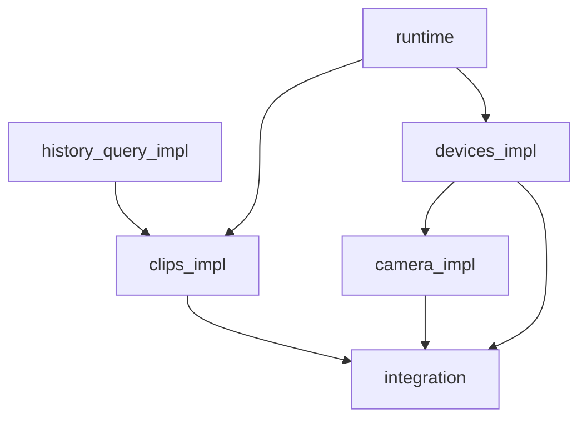

# Flutter History and Devices plan

Implementation is authorized through five coordinated agents. Their worktrees
start from `7984629cb`. Deliver the earliest functional core first; do not mix
unrelated refactors into this work.

History is a list with a side preview at wide widths and a detail dialog at
narrow widths. Development uses an isolated data profile as a safe assumption
chosen by the parent agent. Connection to an existing production data directory
is optional, remains unanswered by the user, and must not occur without an
explicit decision. No UI may use hard-coded history records, peers, permissions,
or pairing results.

## Shared implementation rules

Use ready-made `shadcn_flutter` components directly: `Scaffold`, `AppBar`,
`TextField` or `Input`, `Select`, `Card`, `Badge`, `Button` with style modifiers,
`Tooltip`, `DropdownMenu`, `Dialog`, `Sheet`, `NavigationBar`, and expandable
`NavigationRail`. All application UI icons use `LucideIcons` from
`shadcn_flutter` through public component APIs.

`shadcn_flutter 0.0.55` has no suitable `FileItem` or `FilePicker` for History
rows. Use `Card`, a Lucide file icon, and Rust-provided metadata instead of
creating a file component. Do not use `SelectPopup.builder`: its overflow icons
are Radix and cannot be replaced through a public API. Brand logos, content
thumbnails, and native OS titlebar controls are not application UI icons.

## History

History supports text and `text/*`, PNG, TIFF and `image/*`, files, and an
unknown-type fallback. It uses a lazy list and loads image previews only when
needed. Text renders as text; image, file, and unknown rows use typed metadata
and a safe fallback without inferring content.

Search, filters, and sorting apply to the whole retained dataset. Rust owns the
paged query contract, stable cursors, pin ordering, full-history filters and
sorts, and the file-metadata DTO. Existing actions remain Rust-owned: `get`,
`copy`, `copy_plain_text`, `delete`, `delete_all`, `pin`, `reorder_pinned`, and
`watch`. Flutter presents results and sends those actions through the typed
runtime boundary.

## Devices

Rust owns `PairCreateInvite`, `PairJoin`, `PairProgress`, `PairConfirm`,
`PairCancel`, `Peers`, `Discovered`, `Rescan`, `SyncNow`, `Unpair`, and
`Revoke`, including bound SAS, bilateral confirmation, expiry, cancellation,
and cleanup. Flutter presents Rust state and must not duplicate or weaken those
decisions.

Before QR or SAS is shown, enable capture protection. Render a new invitation's
QR immediately; keep SAS reveal explicit. Keep invite, join, SAS confirmation,
expiry, cancellation, and cleanup as visible decision states. Never place
credentials, pairing material, QR payloads, or SAS values on the clipboard.

Camera and QR support remain behind typed adapters. Package and source
compatibility are owned by the camera agent; no camera fallback may fabricate
pairing data or bypass protected presentation.

## Ownership and dependency graph

| Owner | Responsibility | Depends on |
| --- | --- | --- |
| `history_query_impl` | Rust paged History query, full-history filters/sorts, file metadata | Isolated development profile |
| `runtime_impl` | Maintained `flutter_rust_bridge` generated API, Rust shared runtime/service facades, desktop IPC/daemon and Android in-process core | Existing Rust contracts |
| `clips_impl` | Typed History repository, controller, list, lazy preview, actions, and watch refresh | History query and runtime |
| `devices_impl` | Typed peer/pairing repository, controller, and protected Devices presentation | Runtime and existing Rust pairing contract |
| `camera_impl` | QR/camera typed adapters and compatible package boundary | Protected Devices presentation |
| `integration` | Merge agent commits, run combined checks, launch the integrated development app, and record same-commit evidence | All implementation agents |

The runtime uses maintained `flutter_rust_bridge` generated bindings over
Rust-owned shared runtime and service facades. Desktop keeps the existing IPC
with an app-owned daemon lifecycle. Android uses the shared in-process core and
has no `FakeClipboard` fallback. Bounded bridge details are implementation
work, not a user library decision.

## Acceptance evidence

| Area | Required evidence |
| --- | --- |
| History query | Cursor continuation, pin ordering, search, each filter, and each sort cover the complete retained dataset |
| Content types | Text, image, file, and unknown fallbacks render safely; image previews remain lazy; file rows use Rust metadata |
| History actions | Copy, plain-text copy, delete, delete-all, pin, reorder, and watch display actual backend results |
| Devices | Invite, join, progress, SAS confirmation, expiry, cancel, cleanup, peers, discovery, rescan, sync, unpair, and revoke follow Rust state |
| Pairing security | Capture protection precedes the immediate invite QR and explicit SAS reveal; decisions are gated, and no credential material reaches the clipboard |
| UI reuse | Ready-made shadcn components and Lucide icons are used directly; no visual replicas, parallel icon set, or demo fixtures |
| Native evidence | Same-commit macOS, Android, and Windows evidence covers clipboard action, IME, navigation, QR/camera if approved, QR/SAS protection, pairing cancellation, tray, and desktop lifecycle |

At `2ad52434f`, 35 Flutter tests, formatting, analysis, `git diff --check`,
the macOS debug build, and the Android APK debug build passed. The Windows build
and native pairing, tray, and other interaction evidence remain unverified.
